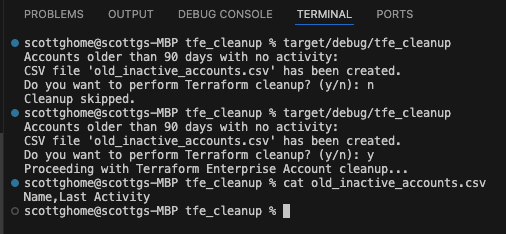

# tfe_cleanup
Cleanup TFE accounts that have been unused for more than 90 days.  
  
This is handy in environments that have Workspace account sprawl, and you need to get  
the number of TFE accounts down so that Hashicorp doesn't bill you for unused accounts.  
  

  

